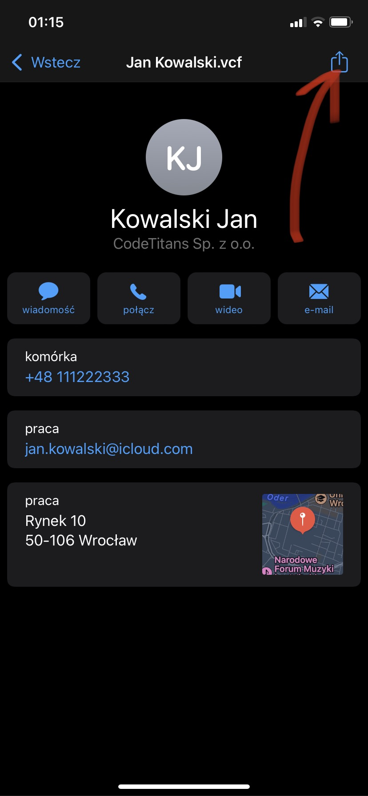
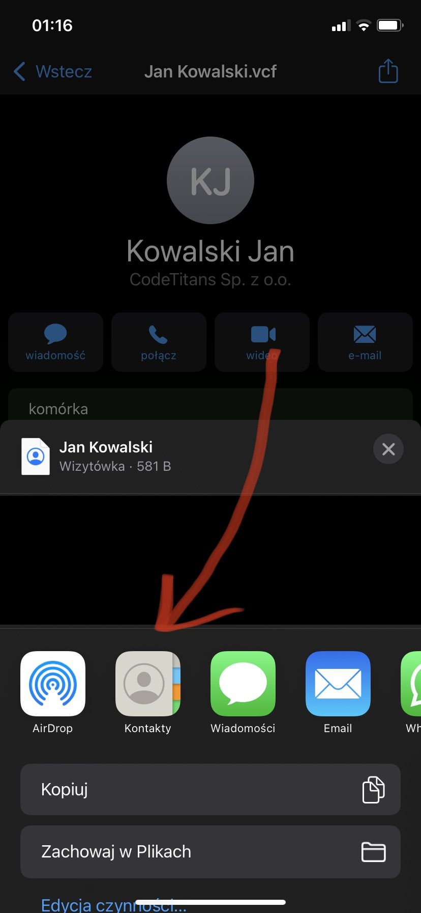
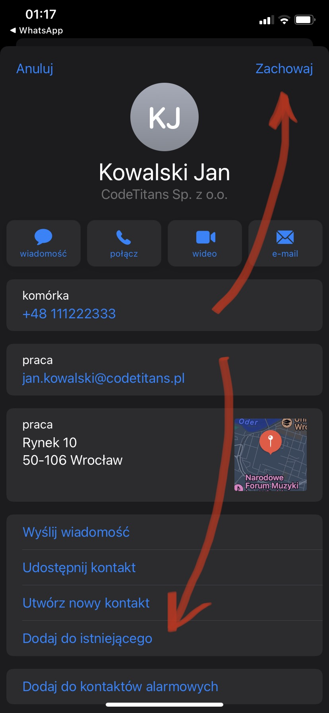
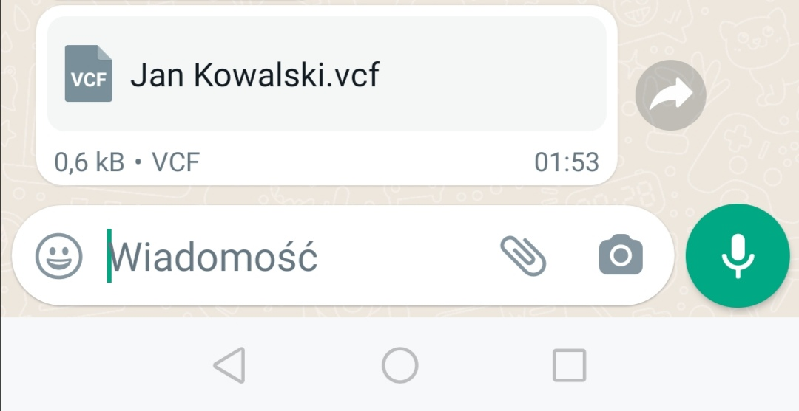

Ten projekt opisuje jak na swoim telefonie zaimportować plik kontaku (tj. zawierający: imię, nazwisko, numer telefonu i prawdopodobnie adres) zapisany w formacie [vCard](https://pl.wikipedia.org/wiki/VCard) (.vcf).

Źródłem tego pliku może być chociażby użycie funkcji eksportu w aplikacji [Kontakty](https://play.google.com/store/apps/details?id=com.google.android.contacts&hl=pl). A następnie przesłanie tak otrzymanego pliku pomiędzy dwoma urządzaniami :iphone:.

## iOS

Procedura importu na urządzeniu marki Apple z systemem iOS wymaga kilku kliknięć.

1. Znajdź wiadomość z plikiem wizytówki i pacnij ją.

    

1. W tym momencie powinny wyświetlić się szczegóły, a wśród nich imię i nazwisko, dane teleadresowe, lokalizacja oraz nazwa i opis firmy.

    Aby działać dalej i umieścić tę osobę w swoich kontaktach trzeba przycisnąć przycisk `dzielenia się`, dostępny w prawym górnym rogu.

    

1. Następnie wybieramy z listy dostępnych aplikację `Kontakty`, która ma otrzymać ten plik wizytówki.

    

1. Ostatni, a zarazem najwaniejszy krok - zapisujemy dane z wizytówki do listy kontaktów, lub łączymy z istniejącym.

    

1. Gotowe! Zadana osoba powinna pokazać się na liście kontaktów.

:fire::fire::fire::fire::fire:

--------

## Android

Procedura importu na urządzenia z systemem Android - może niestety różnić się u każdego z producentów. Niemniej jednak poniżej przedstawiam prawdopodobny jej przebieg. Jeśli jakiś punkt nie wystąpił, to zachęcam do kontynuowania czytania.

1. Znajdź wiadomość z plikiem wizytówki i pacnij ją, aby otworzyć.

    

1. **Opcjonalne** Spowoduje to prawdopodobnie wyświetlenie zapytania o aplikację, która ma zostać użyta do tego celu.

    I albo zostanie zasugerowana aplikacja `Kontakty`, albo z listy ją wybieramy.

    

    > Jeśli wcześniej została wybrana opcja `Zawsze`, wówczas wskazanego pytania nie będzie, tylko od razu wizytówka zostanie wysłana do wybranej aplikacji.

1. **Opcjonalne** Możliwe też, że bezpośrednie otwarcie w aplikacji `Kontakty` jeszcze raz będzie wymagało potwierdzenia, że właśnie to chcieliśmy zrobić.

    

1. Dalej wybieramy listę, do której ma zostać dołączona importowana wizytówka.

    I tak do wyboru są dwie opcje:

    * bezpośrednio do pamięci telefonu

    * lub do współdzielonych z chmurą kontaktów konta Google, które jest przypisane jako właściciel telefonu

    

1. I gotowe.

    Zapewne ujrzymy komunikat potwierdzający tam, gdzie zaczęliśmy (czyli w komunikatorze WhatsApp), że operacja została zakończona.

    

    A w samych kontaktach odnajdziemy zaimportowaną wizytówkę.

    

    wraz ze wszystkimi szczegółami:

    

:fire::fire::fire::fire::fire:

--------
CodeTitans (2022)
