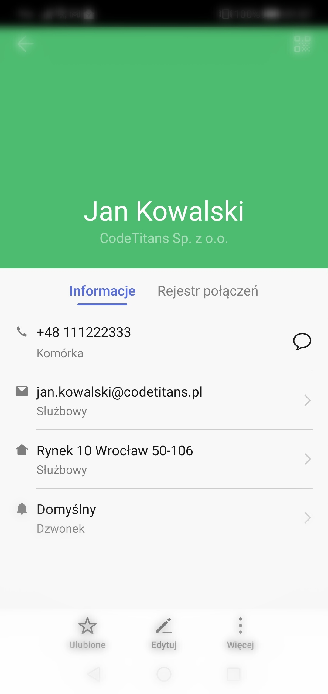

# Import na telefonie z systemem Android

Procedura importu na urządzenia z systemem Android - może niestety różnić się u każdego z producentów. Niemniej jednak poniżej przedstawiam prawdopodobny jej przebieg. Jeśli jakiś punkt nie wystąpił, to zachęcam do kontynuowania czytania.

1. Znajdź wiadomość z plikiem wizytówki i pacnij ją, aby otworzyć.

    

1. **Opcjonalne** Spowoduje to prawdopodobnie wyświetlenie zapytania o aplikację, która ma zostać użyta do tego celu.

    I albo zostanie zasugerowana aplikacja `Kontakty`, albo z listy ją wybieramy.

    

    > Jeśli wcześniej została wybrana opcja `Zawsze`, wówczas wskazanego pytania nie będzie, tylko od razu wizytówka zostanie wysłana do wybranej aplikacji.

1. **Opcjonalne** Możliwe też, że bezpośrednie otwarcie w aplikacji `Kontakty` jeszcze raz będzie wymagało potwierdzenia, że właśnie to chcieliśmy zrobić.

    

1. Dalej wybieramy listę, do której ma zostać dołączona importowana wizytówka.

    I tak do wyboru są dwie opcje:

    * bezpośrednio do pamięci telefonu

    * lub do współdzielonych z chmurą kontaktów konta Google, które jest przypisane jako właściciel telefonu

    

1. I gotowe.

    Zapewne ujrzymy komunikat potwierdzający tam, gdzie zaczęliśmy (czyli w komunikatorze WhatsApp), że operacja została zakończona.

    

    A w samych kontaktach odnajdziemy zaimportowaną wizytówkę.

    

    wraz ze wszystkimi szczegółami:

    

:fire::fire::fire::fire::fire:

--------
CodeTitans (2022)
