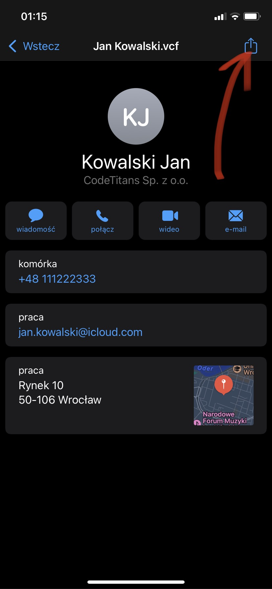
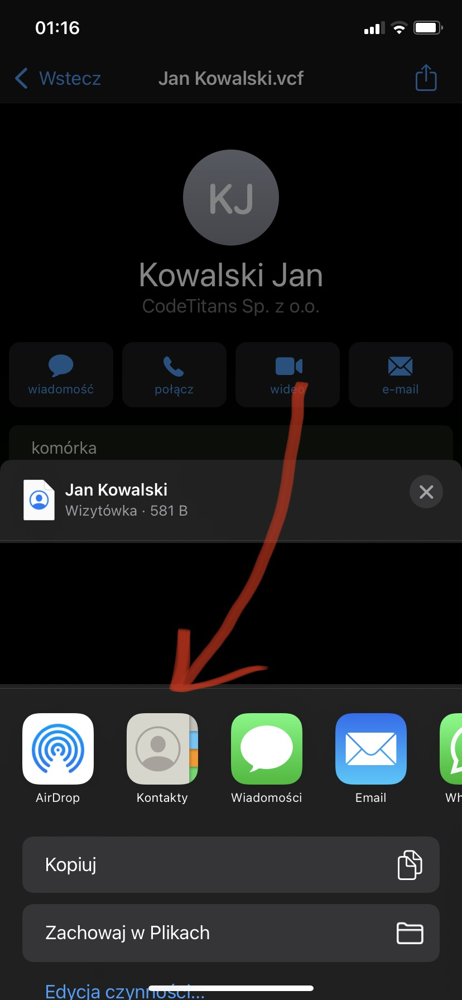
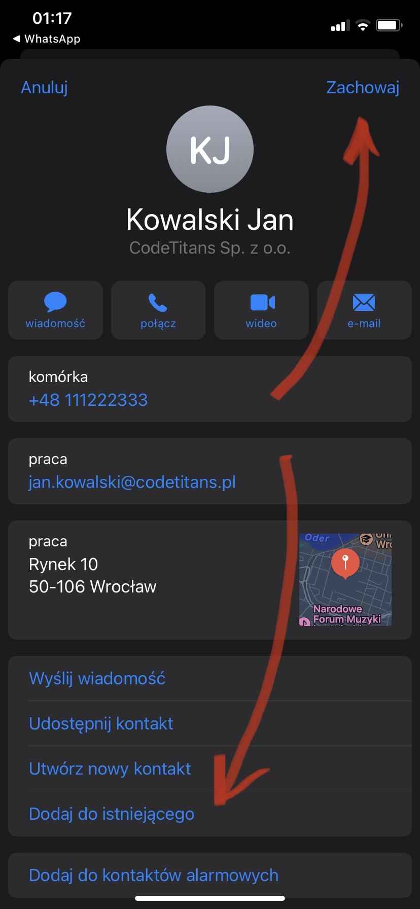

# Import na telefonie z systemem iOS

Procedura importu na urządzeniu marki Apple z systemem iOS wymaga kilku kliknięć.

1. Znajdź wiadomość z plikiem wizytówki i pacnij ją.

    

1. W tym momencie powinny wyświetlić się szczegóły, a wśród nich imię i nazwisko, dane teleadresowe, lokalizacja oraz nazwa i opis firmy.

    Aby działać dalej i umieścić tę osobę w swoich kontaktach trzeba przycisnąć przycisk `dzielenia się`, dostępny w prawym górnym rogu.

    

1. Następnie wybieramy z listy dostępnych aplikację `Kontakty`, która ma otrzymać ten plik wizytówki.

    

1. Ostatni, a zarazem najwaniejszy krok - zapisujemy dane z wizytówki do listy kontaktów, lub łączymy z istniejącym.

    

1. Gotowe! Zadana osoba powinna pokazać się na liście kontaktów.

:fire::fire::fire::fire::fire:

--------
CodeTitans (2022)
